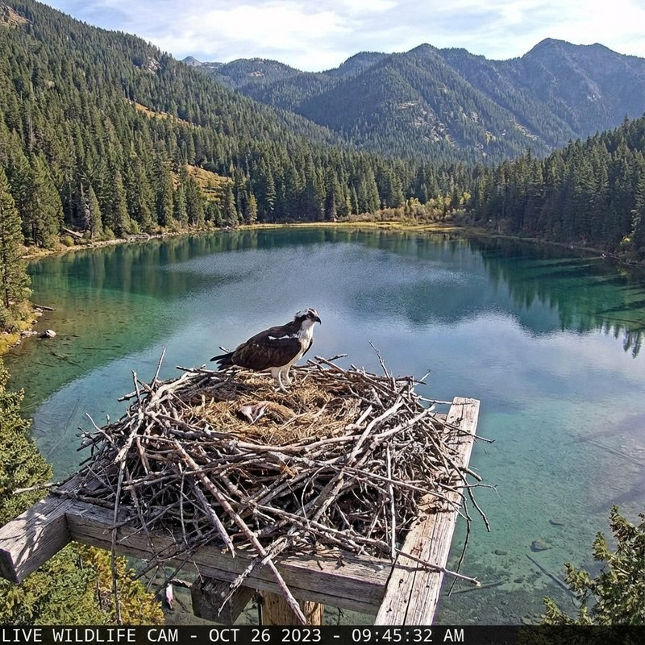

# Nature on Zoom 🦉🌿



**Nature on Zoom** — это современная стриминговая платформа для наблюдения за дикой природой в режиме реального времени. Проект создан с использованием передовых веб-технологий для обеспечения максимальной производительности, эстетического удовольствия и безопасности.

## ✨ Особенности

- **8 Живых трансляций**: Наблюдайте за редкими птицами в HD качестве.
- **Интерактивные чарты**: Статистика зрителей и битрейта в реальном времени.
- **Безопасная оплата**: Интегрированная система подписки с современным UI.
- **OAuth Авторизация**: Быстрый вход через защищенные протоколы.
- **DPI Protection**: Архитектура проекта оптимизирована для работы в условиях строгого сетевого контроля.

## 🛠 Технологический стек

### Frontend
- **HTML5 & CSS3**: Современная верстка с использованием CSS Variables и Grid/Flexbox.
- **Vanilla JavaScript**: Легкая и быстрая логика без лишних зависимостей.
- **SVG Animations**: Плавные микро-взаимодействия и иконки.

### Backend
- **Node.js**: Высокопроизводительный runtime.
- **WebSocket (ws)**: Потоковая передача данных о состоянии стримов.
- **Express**: Легкий и масштабируемый HTTP API.

## 🚀 Быстрый старт (Development)

1. **Клонируйте репозиторий**:
   ```bash
   git clone https://github.com/nicelight/nature-on-zoom.git
   cd nature-on-zoom
   ```

2. **Запустите фронтенд**:
   Используйте любой статический сервер, например `live-server`:
   ```bash
   npx live-server --port=8000
   ```

3. **Запустите WebSocket-сервер**:
   ```bash
   cd server
   npm install
   node index.js
   ```

## 📦 Деплой на Production

Подробные инструкции по развертыванию на серверах AlmaLinux/CentOS с интеграцией Nginx и настройкой SSL доступны в нашем [Runbook](spec/docs/DEPLOY-RUNBOOK.md).

## 🔒 Безопасность и Маскировка

Проект разработан с учетом архитектуры **VLESS over WebSocket**, что позволяет интегрировать его с существующими VPN-решениями, обеспечивая легитимный фасад стримингового сервиса для систем анализа трафика (DPI).

---
*Developed with ❤️ for Nature Lovers.*
